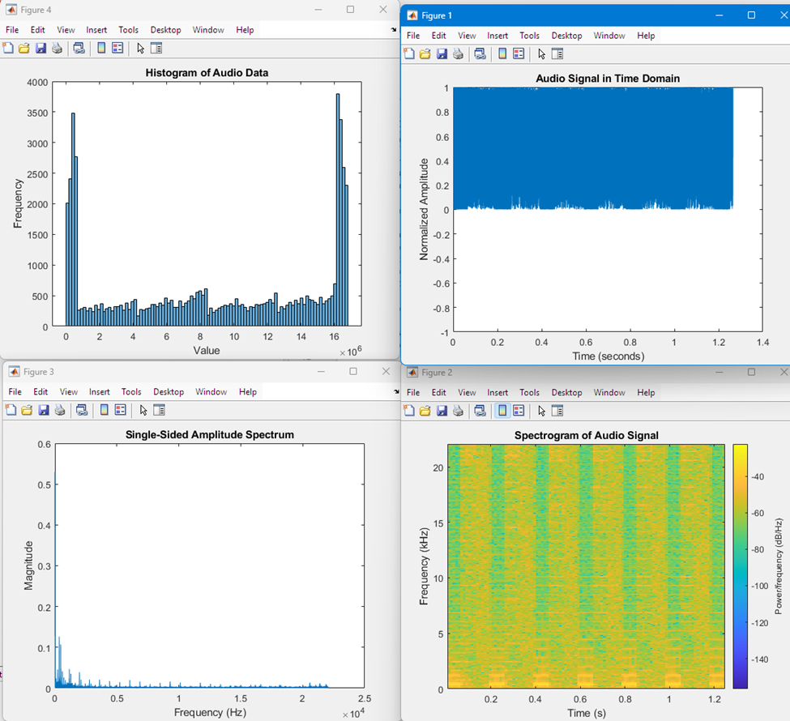

# I2S Demo Project

## Overview
The I2S Demo project is a sub-project of NodeTuner, developed to verify the characteristics of real-world audio signals against those observed in simulations. Initially motivated by the discovery that simulated audio signals appeared as clean sine waves, I started this project to understand how these compare to actual audio inputs.

## Objective
The primary objective of this project is to capture and analyze real-world audio signals, significantly enhancing the accuracy of NodeTuner’s audio processing capabilities. A critical aspect of achieving this objective involves the implementation of Clock Domain Crossing (CDC) techniques. These techniques are essential for ensuring data integrity and timing precision when transferring data across components operating at different clock frequencies. CDC helps to avoid issues like data corruption and loss, which can occur when signals cross between the faster I2S clock domain and the slower UART domain. By effectively managing these transitions, CDC ensures that the system can handle high-speed data acquisition and slow-speed data communication without compromising the accuracy and reliability of the audio data analysis.

## MATLAB Plot

## Components
- **I2S Top-Level Entity**: Manages interfacing and signal processing.
- **I2S Receiver**: Captures audio data through the I2S interface.
- **BRAM (Block RAM)**: Stores the audio data received.
- **UART Transmission**: Sends the stored audio data to a PC for analysis.
- **MATLAB Analysis**: Processes the data stored in a .csv file using MATLAB scripts to analyze the signal.
- **ILA Tool**: Ensures the integrity of the audio signals received by the FPGA.

## Workflow
1. **Audio Reception**: Audio data is collected via the I2S receiver and stored in BRAM.
2. **Data Verification**: The ILA tool is used to verify the accuracy of the audio signals received.
3. **Data Transmission**: Audio data is transmitted from BRAM to the PC through UART.
4. **PC Data Handling**: The incoming data is captured and stored in a .csv file on the PC.
5. **Signal Analysis**: MATLAB scripts are used to analyze the .csv file to determine the actual characteristics of the audio signals.

## Challenges and Solutions
I encountered significant challenges with timing and metastability due to the different clock rates of the I2S and UART interfaces. To manage these issues:
- **Dual Clock Frequencies**: I configured the BRAM entity to operate with two different clock frequencies. The first is synchronized with the I2S input to ensure accurate and immediate data capture. The second matches the UART output, which operates at a slower rate, to manage data transmission to the PC effectively.
- **FIFO Management and CDC: A FIFO system was implemented within the BRAM to facilitate a stable transfer of data between the two clock domains. Clock Domain Crossing (CDC) techniques were applied to ensure that the data transitions smoothly and reliably from the faster I2S clock domain to the slower UART domain, mitigating risks of data loss and ensuring overall system stability.
